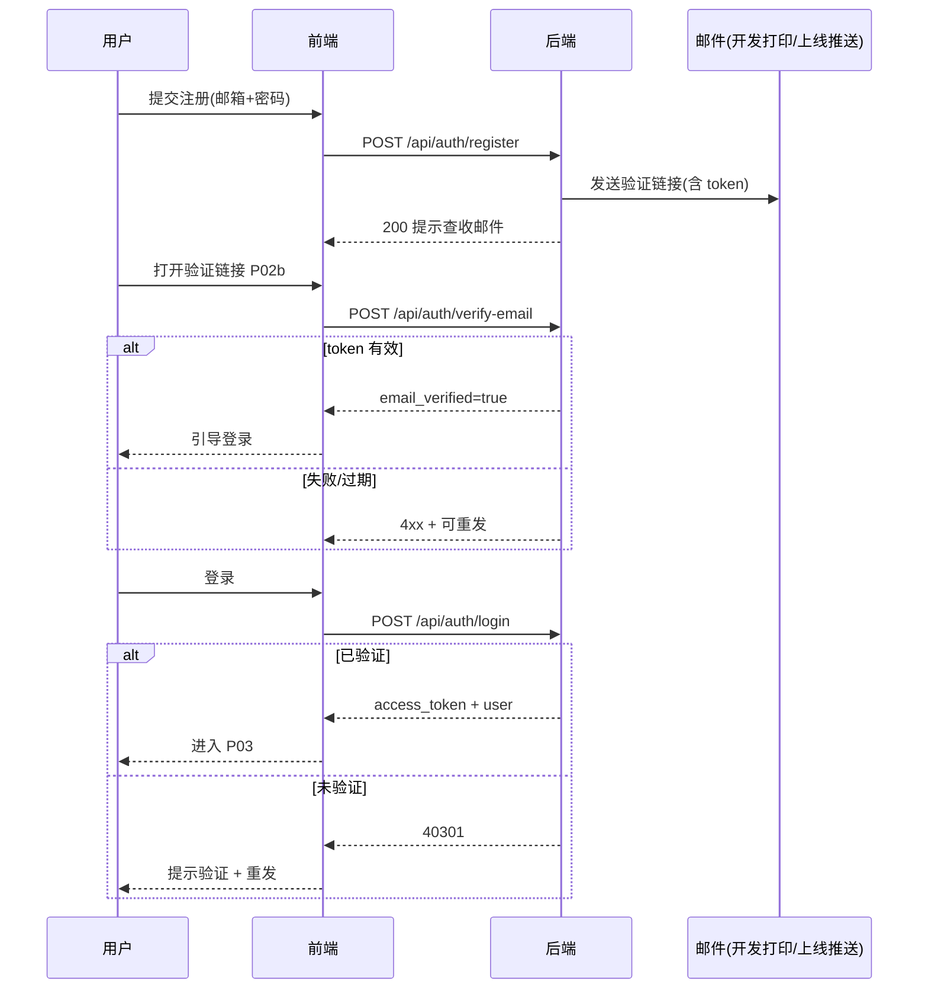
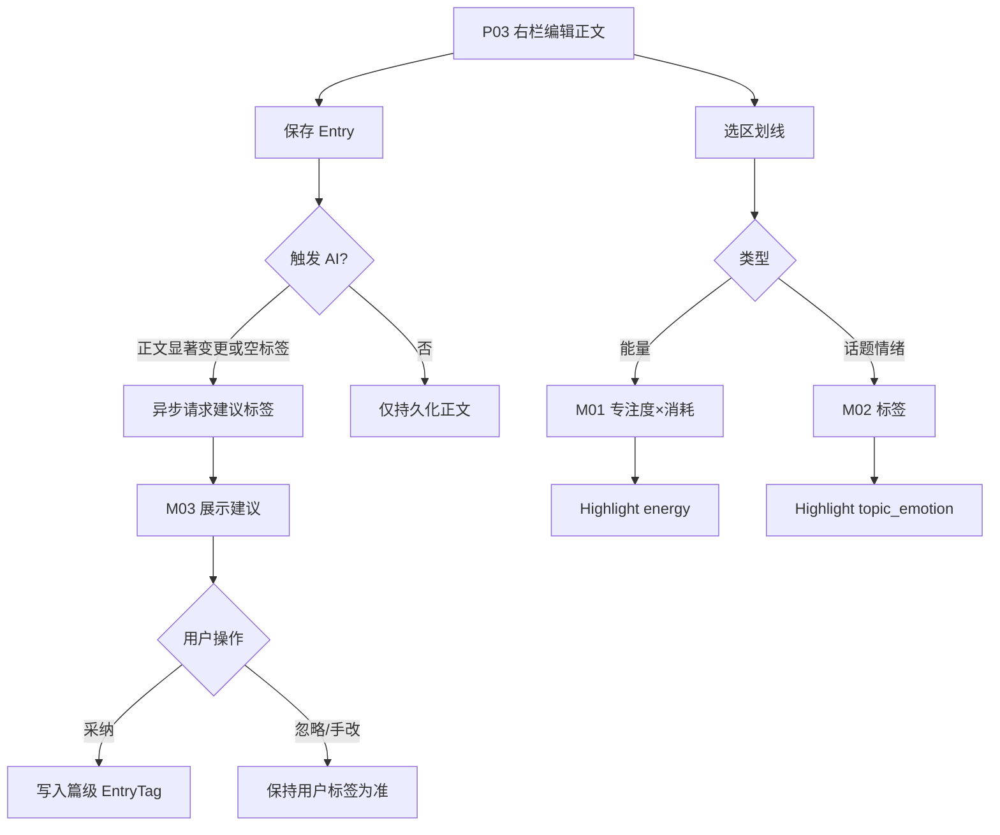
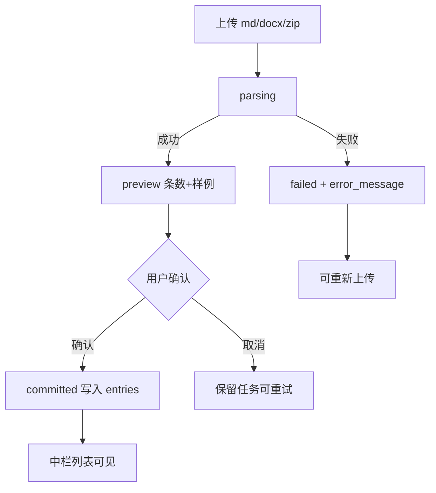

# 漫长游记 — 产品需求文档（PRD）定稿

> 项目：`journal-growth` · 类型：Web · **阶段 C 定稿**（与已确认 Pencil 原型 + 本期范围一致）  
> 基于阶段 R 定稿：方案 C（Day One 式编辑 + 划线浮窗 + 洞察回看）+ 多巴胺视觉  
> **本期洞察**：自我认知 + 美好时光；情绪图谱（P07）后置

---

## 1. 背景与调研结论

### 1.1 一句话定位

用于随时捕捉想法与情绪碎片、借助 AI 辅助结构化标签，并在时间维度上回看自我认知、情绪变化与「投入×耗能」美好时光的个人成长日记工具。

### 1.2 目标用户

- 先自用，再开放注册；**多用户、数据按用户隔离**
- 现有日记在飞书文档，需要批量导入
- 希望多巴胺配色 + 卡通几何角色，用颜色与形状编码情绪与能量

### 1.3 核心场景

1. 写长文日记，文内划线记录能量（投入/耗能）与话题/情绪  
2. 提交后 AI 建议标签，用户可改  
3. 按话题时间线回看想法（自我认知）  
4. 美好时光四象限发现喜欢/擅长的事  

> **本期不做**：情绪图谱观察情绪起伏（原场景 4；P07 后置，见 §1.5）

### 1.4 竞品与视觉方向（阶段 R）

- 参考：flomo（标签回顾）、Day One（沉浸编辑）、Daylio（情绪可视化）、美好时光日志方法论（投入×能量）
- **选定**：融合方案 C + 用户提供的多巴胺参考图  
- 视觉证据：`.sdd/tmp/visual-research.md` 与 `.sdd/tmp/visual-refs/`

### 1.5 MVP 不做 / 本期后置

- 往年今日  
- 飞书 API 直连  
- 小程序端  
- 三种「记录本模式」产品包装  
- AI 对「观念是否变化 / 你该怎样」下结论  
- AI 估计能量值  
- **情绪图谱（P07）整页**：日/周/月可视化、横轴多情绪图案、下钻聚合（**本期不做**；情绪形状资产可保留用于登录氛围等）

---

## 2. 页面清单与跳转逻辑（A1）

### 2.1 页面清单

| 序号 | 页面名称 | 页面类型 | 可见角色 | 入口来源 | 跳转去向 |
|------|---------|---------|---------|---------|---------|
| P01 | 登录页 | 表单页 | 访客 | 直接访问 / 未登录拦截 | P03；链到 P02 |
| P02 | 注册页 | 表单页 | 访客 | 登录页 | 验证提示 → P01 |
| P02b | 邮箱验证页 | 结果页 | 持链接访客 | 邮件链接 | 成功 → P01 |
| P03 | 日记工作台（三栏合一） | 列表+编辑复合页 | 已登录且已验证 | 默认首页；侧栏「日记」；洞察下钻 | 本页内中栏选篇 ↔ 右栏编辑 |
| P06 | 自我认知 | 筛选+时间线 | 同上 | 左侧导航 | → P03（定位摘录） |
| P07 | 情绪图谱 | 可视化 | — | **本期不做（后置）** | — |
| P08 | 美好时光 | 四象限 | 同上 | 左侧导航 | → P03 |
| P09 | 日记导入 | 向导页 | 同上 | 左侧导航 | → P03 |
| P10 | 设置（我的） | 设置页 | 同上 | 侧栏顶部头像点击 | 退出 → P01 |

> **日记不拆时间线/详情两页**：宽屏为 **左导航 | 中栏日记列表 | 右栏正文编辑**（参考 Day One 三栏）。原独立日记页并入 P03 右栏。

### 2.2 浮层 / 模块

| 编号 | 名称 | 触发 |
|------|------|------|
| M01 | 能量记录浮窗 | 划线新建或点击能量高亮 → 专注度♡(0–5，支持 0.5) + 能量消耗⚡(0–5，支持 0.5) |
| M02 | 话题/情绪批注浮窗 | 划线新建或点击话题/情绪高亮 → 展示/编辑标签 |
| M03 | AI 标签建议条 | 保存后异步出现，可采纳/忽略/手改 |

### 2.3 全局布局

```text
宽屏整体（对齐飞书骨架）：
  ┌──────────┬─────────────────────────────┐
  │ 头像+产品名│                             │
  │ 导航列表  │  主内容区                     │
  │          │  （日记页再拆：列表 | 正文）    │
  └──────────┴─────────────────────────────┘
  侧栏顶部：圆形头像 + 产品名；hover 头像浮窗邮箱；点击进「我的」
  侧栏下方：日记 / 自我认知 / 美好时光 / 导入（情绪图谱本期不做，不进导航）
  日记主区：中栏筛选图标+小号写日记+列表；右栏正文+小号保存
  不使用整页顶栏占一行
```

### 2.4 跳转图

```text
P01 ⇄ P02 → 邮件 → P02b → P01
  ↓
P03 日记工作台（中栏 ↔ 右栏，含 M01/M02/M03）
  ├→ P06 → P03（定位）
  ├→ P08 → P03
  ├→ P09 → P03
  └→ P10 → P01
  （P07 情绪图谱：本期不做）
```

---

## 3. 主要功能定义与分析（A2）

### 页面：P01 登录页

| 功能编号 | 功能名称 | 一句话描述 | 完成标准 |
|---------|---------|-----------|---------|
| F-01-01 | 邮箱密码登录 | 已验证账号用邮箱+密码+登录验证码登录 | 验证码校验通过后进入 P03 |
| F-01-02 | 跳转注册 | 去注册 | 打开 P02 |
| F-01-03 | 未验证拦截 | 未验证不可进主站 | 明确提示 + 重发入口 |

| 功能编号 | 包含 | 不包含 |
|---------|------|--------|
| F-01-01 | 邮箱+密码+登录验证码、错误提示、会话 | 第三方登录 |

### 页面：P02 / P02b 注册与验证

| 功能编号 | 功能名称 | 完成标准 |
|---------|---------|---------|
| F-02-01 | 邮箱+密码注册 | 提示已发验证邮件 |
| F-02-02 | 密码规则校验 | 不合规即时提示 |
| F-02b-01 | 链接验证成功 | 引导登录 |
| F-02b-02 | 链接失败/过期 | 可重发 |

### 页面：P03 日记工作台（核心 · 三栏）

#### 中栏 · 日记列表

| 功能编号 | 功能名称 | 完成标准 |
|---------|---------|---------|
| F-03-01 | 按月分组列表 | 日期块、标题、正文若干字、标签；图片位后期 |
| F-03-02 | 标签/条件筛选 | 中栏顶图标触发筛选；多选 AND 可清空 |
| F-03-03 | 选中条目 | 右栏打开该篇（当前行高亮） |
| F-03-04 | 快捷新建 | 中栏顶小号「写日记」→ 右栏空白稿 |
| F-03-05 | 空态 | 引导写作或导入 |

#### 右栏 · 日记正文

| 功能编号 | 功能名称 | 完成标准 |
|---------|---------|---------|
| F-03-11 | 顶栏日期+标题 | 可编辑；日期默认当天 |
| F-03-12 | 第二行标签 | 情绪/话题篇级标签可改 |
| F-03-13 | 正文编辑 | 简易富文本：换行、加粗、字体颜色；文末显示最近更新时间 |
| F-03-14 | 划线高亮 | 选中正文可新建能量/话题标记；能量♡⚡ 与话题/情绪样式可辨 |
| F-03-15 | 点击高亮批注浮窗 | 展示该标记批注内容 |
| F-03-16 | 新建划线 | 选区 → M01 / M02 |
| F-03-17 | AI 建议 M03 | 异步建议；可采纳/忽略 |
| F-03-18 | 底部能量卡片 | 汇总本篇能量划线；**无则不展示** |
| F-03-19 | 保存/删除 | 小号保存按钮；删除需确认 |
| F-03-20 | 洞察定位 | 从洞察进入时滚到目标高亮 |

| 功能编号 | 包含 | 不包含 |
|---------|------|--------|
| F-03-01 | 日期、标题、摘要、标签 | MVP 强制配图 |
| F-03-14 | 仅用户录入能量 | AI 估专注度/耗能 |

### 页面：P06 自我认知

| 功能编号 | 功能名称 | 完成标准 |
|---------|---------|---------|
| F-06-01 | 顶部横向话题筛选 | 选中思考类话题后下方刷新 |
| F-06-02 | 下方时间线文本 | 按时间展示对应正文/摘录 |
| F-06-03 | 下钻 | 回 P03 并定位 |

| 功能编号 | 包含 | 不包含 |
|---------|------|--------|
| F-06-02 | 聚合展示 | AI「是否变化」结论 |

### 页面：P07 情绪图谱（本期不做 · 后置）

> **本期范围外**。以下仅作后续 backlog 备忘，本期不设计验收、不进侧栏、不开发。

| 功能编号 | 功能名称 | 完成标准 |
|---------|---------|---------|
| F-07-01 | 日/周/月切换 | 横轴时间粒度切换 |
| F-07-02 | 横向时间轴 + 多情绪 Y | 同一时间可叠多种情绪图案 |
| F-07-03 | 下钻 | 打开 P03 对应日记 |

**数据规则（后置）**：划线情绪优先；无则回退篇级情绪标签。

### 页面：P08 美好时光

| 功能编号 | 功能名称 | 完成标准 |
|---------|---------|---------|
| F-08-01 | 上方四宫格 | 专注度×能量消耗散点落在对应象限 |
| F-08-02 | 默认范围 | **默认最近 10 篇含能量标记的笔记** |
| F-08-03 | 范围配置 | 可改篇数或时间区间 |
| F-08-04 | 点击散点 | 下方列表聚焦该日记标记切片 |
| F-08-05 | 点击象限区域 | 下方列出该区域内全部标记切片，可时间正序/倒序 |
| F-08-06 | 下方切片列表 | 页面分上下：上四宫格、下为选择后的日记切片内容 |
| F-08-07 | 象限观察记录 | 可针对某一象限记录共性/想法；每条观察**归属一个象限**；列表展示**提交/更新时间** |
| F-08-08 | 下钻原文 | 从切片回 P03 定位摘录 |

| 功能编号 | 包含 | 不包含 |
|---------|------|--------|
| F-08-01 | 分界默认 2.5 / 2.5 | 无标记不入图；说教文案 |
| F-08-07 | 用户自写观察；按象限筛选/展示 | AI 自动写观察结论（后置可选） |

### 页面：P09 日记导入

| 功能编号 | 功能名称 | 完成标准 |
|---------|---------|---------|
| F-09-01 | 上传 md/docx（或 zip） | 见进度 |
| F-09-02 | 预览拆篇 | 见条数与样例 |
| F-09-03 | 确认入库 | 中栏列表出现；失败有明细 |
| F-09-04 | 导入模板 | 提供 Markdown / Word 模板下载与格式说明，提升拆篇成功率 |

| 功能编号 | 包含 | 不包含 |
|---------|------|--------|
| F-09-01 | 飞书导出后再上传 | 飞书 API 直连（V2） |

### 页面：P10 设置

| 功能编号 | 功能名称 | 完成标准 |
|---------|---------|---------|
| F-10-01 | 账号信息 | 邮箱与验证状态 |
| F-10-02 | 修改密码 | 新密码可登录 |
| F-10-03 | 个人标签词库 | 增删改思考/情绪标签 |
| F-10-04 | 退出登录 | 回 P01 |
| F-10-05 | 重发验证邮件 | 收到邮件 |

---

## 4. Mission / Persona / 版本规划（A3）

### Mission

把日记从「记完沉底」变成可回看的成长资料：长文 + 划线能量/话题情绪 + 可改 AI 标签 + 自我认知/美好时光回看；工具只展示，不下人生结论。

### Persona

个人成长记录者；飞书迁移用户；偏好多巴胺视觉与色形情绪编码。

### Business Rules

1. 未邮箱验证不可用主站  
2. 数据按 `user_id` 隔离  
3. 能量仅用户划线录入  
4. 标签用户为准，AI 仅建议  
5. 无能量标记不进四象限  
6. 洞察不下「你应该…」结论  
7. MVP 导入 = 文件上传，非飞书 API  

### V1 / MVP

| 页面 | 包含 | 排除 | 理由 |
|------|------|------|------|
| P01–P02b | 邮箱注册登录验证 | OAuth | 简单可上线 |
| P03 | 列表+标签筛选 | 全文搜索 | 非阻塞 |
| P03 | 三栏工作台：列表+正文编辑+双划线+AI+能量卡片 | AI 估能量 | 核心路径 |
| P06、P08 | 自我认知 + 美好时光 + 下钻 | 情绪图谱 P07、往年今日、说教 | 差异化回看；P07 后置 |
| P09 | md/docx 导入 | 飞书直连 | 满足存量迁移 |
| P10 | 账号+标签词库 | 主题商店 | 够用 |

### V2+

| 功能 | 版本 | 理由 |
|------|------|------|
| 情绪图谱 P07 | V1.1 | 本期明确后置 |
| 往年今日 | V1.1 | 已明确后置 |
| 飞书 API 直连 | V1.1 | 开放平台成本高 |
| 全文搜索 | V1.1 | 增强 |
| 第三方登录 | V1.2 | 审核与回调 |
| 小程序 | V2 | 需专项规范 |
| 记录本模式包装 | V2 | 能力已覆盖 |
| AI 摘录建议/总结 | V1.2 | 非录入必需 |
| 多媒体入日记 | V2 | 成本高 |

---

## 5. 关键链路与实现思路（A4）

### 5.1 关键链路：邮箱注册验证

- **触发**：注册提交 / 重发验证  
- **思路**：后端生成一次性 token（有过期）→ 发验证邮件（含链接到 P02b）→ 点击校验 token → `email_verified=true`  
- **选型**：开发期打印验证链接；上线阿里云邮件推送（见 A5-3）  
- **状态**：已确认（开发打印 / 上线阿里云）

### 5.2 关键链路：文内划线双模式

- **触发**：在 P03 右栏正文选中文本  
- **思路**：选区记录 `start_offset` / `end_offset`（或稳定文本锚点）+ 摘录原文快照；分支：  
  - M01：写入 `engagement` / `drain`，取值 **0–5，步进 0.5**（支持半颗心/半闪电），类型=`energy`  
  - M02：写入话题/情绪标签 ID 列表，类型=`topic_emotion`  
- **点击已有高亮**：打开对应批注浮窗（只读/可改）  
- **UI**：两种浮窗不同强调色/图标，避免误触  
- **风险**：改正文后偏移失效 → MVP 保存时重算或提示「标记可能需重标」；优先保留摘录快照用于洞察展示  

### 5.3 关键链路：AI 多标签建议

- **触发**：日记首次保存或正文显著变更后保存  
- **思路**：将正文 + 用户当前标签词库（思考类/情绪类枚举）送 LLM，要求 JSON 多标签输出；服务端校验标签必须落在词库或标记为「建议新建」；前端展示 M03  
- **选型**：DeepSeek `deepseek-v4-pro`，`base_url=https://api.deepseek.com`，JSON mode；无 Key 时 Mock  
- **边界**：不写能量；不自动覆盖用户已手改标签（策略：仅当篇级标签为空或用户点「重新建议」时覆盖建议区）  

### 5.4 关键链路：飞书导出文件导入

- **触发**：P09 上传  
- **思路**：解析 md/docx → 按一级/二级标题或日期行拆篇 → 预览 → 批量插入 `entries`（默认无划线、无能量；可触发批量 AI 打标可选）  
- **日期识别**：标题或文首 `YYYY-MM-DD` / `YYYY年M月D日`；失败则用导入日并在预览中标黄可手改  
- **导入模板**：P09 提供 Markdown / Word 模板下载；推荐「`# 标题` → `日期：…` → 正文」，篇间空行或 `---`  
- **不做**：飞书 Open API  

### 5.5 关键链路：情绪图谱聚合（本期不做 · 后置）

> 本期不实现。备忘：

- **规则**：时间范围内，优先收集 `topic_emotion` 划线中的情绪标签为点；若某篇无此类划线，则用该篇篇级情绪标签各生成点（落在 `entry.event_date`）  
- **视觉**：情绪→颜色+形状映射表（与多巴胺规范一致，B1 细化）  

### 5.6 关键链路：美好时光四象限

- **布局**：上 = 四宫格散点；下 = 当前选择对应的日记切片列表；另有「象限观察」区（可与下方并列或切片列表旁/下）  
- **默认范围**：最近 10 条含 energy 标记的笔记；可配篇数或时间区间  
- **交互**：点散点 → 下方聚焦该切片；点象限区域 → 下方列出该区全部切片（正序/倒序）  
- **观察记录**：用户新建一条文本，必选归属象限（四选一）；可按当前选中象限筛选显示；展示 `created_at`/`updated_at` 提交时间  
- **下钻**：带 `highlight_id` 打开 P03 并定位  

---

## 6. 数据契约确认清单（A5-1）

### 用户 User

- [x] `id` (uuid)  
- [x] `email` (string, unique)  
- [x] `password_hash` (string)  
- [x] `email_verified` (bool)  
- [x] `created_at` / `updated_at`  

### 验证令牌 EmailVerificationToken

- [x] `token`、`user_id`、`expires_at`、`used_at`  

### 会话 Session / JWT

- [x] 登录后颁发访问凭证；多设备可多会话（或无状态 JWT + 过期）  

### 标签词库 Tag（按用户）

- [x] `id`、`user_id`、`kind`：`emotion` | `thinking`  
- [x] `name`、`color`（可选）、`shape`（可选，情绪用）、`sort_order`、`is_system_default`  
- [x] 注册时写入默认枚举副本，之后用户可改  

### 默认思考类标签

人际关系、情绪、亲密关系、家庭、职业规划、工作状态、金钱观、价值判断、人生观、世界观、健康、学习成长、兴趣爱好、生活探索、死亡、重大事件  

### 默认情绪类标签

平静、喜悦、期待、感动、安心、焦虑、疲惫、失落、愤怒、孤独、迷茫、紧张、释然、委屈  

### 日记 Entry

- [x] `id`、`user_id`  
- [x] `title`（可空，默认取首行或「无标题」）  
- [x] `body`（text/HTML：简易富文本，允许换行、`<strong>`、带 color 的 `<span>`、高亮 `<mark>`）  
- [x] `event_date`（date，默认当天）  
- [x] `created_at` / `updated_at`  
- [x] 软删可选：`deleted_at`  

### 篇级标签 EntryTag

- [x] `entry_id`、`tag_id`  

### 划线标记 Highlight

- [x] `id`、`entry_id`、`user_id`  
- [x] `kind`：`energy` | `topic_emotion`  
- [x] `quote_text`（摘录快照）  
- [x] `start_offset` / `end_offset`（整数；富文本下可为近似，以 `quote_text` 为准）  
- [x] energy 专用：`engagement` / `drain`，**number，0–5，步进 0.5**  
- [x] topic_emotion 专用：关联 `HighlightTag`（多标签）  
- [x] `created_at` / `updated_at`  

### AI 建议记录 AiTagSuggestion（可选落库）

- [x] `entry_id`、`suggested_tag_ids`、`status`：pending/accepted/dismissed、`raw_response`、`created_at`  

### 导入任务 ImportJob

- [x] `id`、`user_id`、`filename`、`status`：uploaded/parsing/preview/committed/failed  
- [x] `preview_json`、`error_message`、`created_at`  

### 四象限分界（配置）

- [x] 默认 `engagement_split=2.5`、`drain_split=2.5`（系统常量；用户可调后置）  

### 象限观察记录 QuadrantNote

- [x] `id`、`user_id`  
- [x] `quadrant`：枚举 `high_focus_low_drain` | `high_focus_high_drain` | `low_focus_low_drain` | `low_focus_high_drain`  
- [x] `body`（text）  
- [x] `created_at` / `updated_at`  

### 权限角色

- [x] 仅普通用户（本人数据）；无运营后台角色（MVP）  

---

## 7. 接口响应格式契约（A5-2）

### 统一响应格式

- [x] 成功：`{"code": 200, "message": "success", "data": { ... }}`  
- [x] 错误：`{"code": <错误码>, "message": "<错误描述>", "data": null}`  
- [x] 分页：`{"code": 200, "data": {"items": [...], "total": 100, "page": 1, "page_size": 20}}`  

### HTTP 状态码约定

- [x] 200 成功 / 400 参数错误 / 401 未认证  
- [x] 403 无权限 / 404 不存在 / 500 服务器错误  

### 业务错误码（建议）

- [x] `40001` 参数校验失败  
- [x] `40101` 未登录或 token 无效  
- [x] `40301` 邮箱未验证  
- [x] `40401` 资源不存在或不属于当前用户  
- [x] `40901` 邮箱已注册  
- [x] `42201` AI 暂不可用（可降级 Mock 时仍 200+标记）  

---

## 8. 外部依赖与配置草稿（A5-3）

| 依赖 | 用途 | 关键配置字段 | Key/账号来源 | 存放位置 | 缺失时策略 | 状态 |
|------|------|-------------|-------------|----------|-----------|------|
| LLM DeepSeek | 日记多标签意图建议 | `LLM_API_KEY` `LLM_BASE_URL` `LLM_MODEL` | 用户后续提供；model=`deepseek-v4-pro`，base=`https://api.deepseek.com` | `backend/.env` | **Mock** 建议标签 | **已确认：Key 后补** |
| Embedding | 无（MVP 不做向量检索） | — | — | — | 无 | 无 |
| Rerank | 无 | — | — | — | 无 | 无 |
| 邮件发送 | 注册验证 / 重发 | 开发：`MAIL_DEV_PRINT=true`；上线：阿里云邮件推送相关配置 / SMTP | 开发期打印验证链接；上线：**阿里云邮件推送** | `backend/.env` | 开发打印链接；上线前必须配真实邮件 | **已确认** |
| 对象存储 | 导入文件 | `UPLOAD_DIR` | 本地 | `.env` | 本地目录 | **已确认：本地** |
| 第三方登录 | 无（MVP） | — | — | — | 无 | 无 |
| 支付 | 无 | — | — | — | 无 | 无 |
| 飞书 Open API | 无（MVP） | — | — | — | 无；V2 再加 | 无 |
| 数据库 | 业务存储 | `DATABASE_URL`（PostgreSQL） | 本地 Postgres | `.env` | 阻塞启动 | **已确认：PostgreSQL** |
| 前端 Web | React+TS+Vite+Ant Design | — | — | — | — | 已定栈 |

#### A5-3 确认记录（2026-09-01）

- LLM：Key 后补，开发 Mock  
- 邮件：开发期打印验证链接；上线阿里云邮件推送  
- 上传：本地磁盘  
- 数据库：PostgreSQL  
- 阶段 A 总确认通过，进入 B1

### AI 默认配置（写入开发约定）

- AI 参与功能：篇级思考/情绪标签建议  
- 模型/API：DeepSeek / 用户提供 Key / `https://api.deepseek.com` / `deepseek-v4-pro`；无 Key 时 Mock  
- 默认意图：从用户词库多选思考类 + 情绪类  
- 默认输出：JSON `{ thinking_tags: string[], emotion_tags: string[] }`  
- 自动执行边界：只生成建议，不自动覆盖用户手改，不写能量  
- 必须用户确认：采纳建议标签  
- 材料状态：用户未提供专用提示词 → 实现时使用默认可改提示词  

---

## 9. 技术栈（约定）

- 前端：React + TypeScript + Vite；桌面 Web 用 Ant Design（视觉层用自定义多巴胺主题覆盖）  
- 后端：Python 3.11+ / FastAPI / PyCore  
- 运行时：本机 `python3.11`  

---

## 10. 阶段 A 变更记录

| 日期 | 变更 |
|------|------|
| 2026-09-01 | 初稿：R0–R 定稿落入 A1–A5；P04/P05 合并为可编辑日记页；情绪图谱划线优先 |
| 2026-09-01 | Junior Pass 反馈：日记改为三栏工作台；自我认知顶横筛；情绪图谱日/周/月横轴多 Y；平静改厚水波；美好时光默认近10篇+点/区下钻 |
| 2026-09-01 | 美好时光：上四宫格下切片列表；新增归属象限的观察记录 |
| 2026-09-07 | **本期不做 P07 情绪图谱**：移出侧栏与本期验收；情绪形状资产仍可用于登录页氛围 |
| 2026-09-07 | 阶段 B2 Pencil 原型确认；进入阶段 C 定稿 |

---

## 11. 路线图（终版）

| 版本 | 范围 | 说明 |
|------|------|------|
| **MVP（本期）** | P01–P02b、P03、P06、P08、P09、P10；M01–M03 | 注册登录验证、三栏日记、划线能量/话题、AI 标签建议（可 Mock）、自我认知、美好时光、文件导入、设置 |
| **V1.1** | P07 情绪图谱；往年今日；飞书 API；全文搜索 | 洞察补齐与迁移增强 |
| **V1.2** | 第三方登录；AI 摘录/总结类增强 | 非录入必需 |
| **V2** | 小程序；记录本模式包装；多媒体入日记 | 需专项规范与成本评估 |

发布节奏：先完成前端 Mock UI 验收 → 后端基础设施 → 按 Plan 逐功能联调闭环 → E2E 回归。

---

## 12. 技术架构蓝图

### 12.1 技术选型

| 层 | 选型 | 说明 |
|----|------|------|
| 前端 | React + TypeScript + Vite + Ant Design + Zustand + Axios + react-router | 桌面 Web；多巴胺主题覆盖 Ant Design token |
| 后端 | Python 3.11+ / FastAPI / PyCore | 基于仓库内 `pycore/` 脚手架，禁止重写 config/server/logger |
| 数据库 | PostgreSQL | `DATABASE_URL` |
| 鉴权 | JWT（访问令牌） | 多设备可并存；过期后需重登 |
| AI | DeepSeek `deepseek-v4-pro` | Key 后补；缺失时 Mock 建议 |
| 邮件 | 开发期打印验证链接；上线阿里云邮件推送 | `MAIL_DEV_PRINT` |
| 上传 | 本地目录 `UPLOAD_DIR` | MVP 不做对象存储 |
| 部署 | 单机 / 同域反向代理 | 前端静态 + 后端 API；具体主机在开发期按环境配置 |

### 12.2 分层

```text
Browser (React)
  └─ service / Axios  ──►  /api/*  (FastAPI + JWT)
                              ├─ Auth / User / Tags
                              ├─ Entries / Highlights / AI Suggest
                              ├─ Insights (self / good-times)
                              ├─ Import jobs
                              └─ PostgreSQL
```

### 12.3 部署方案（MVP）

- 本地开发：Vite dev + FastAPI uvicorn；`VITE_USE_MOCK` 控制前端 Mock  
- 联调：`VITE_USE_MOCK=false`，同源或 CORS 代理到后端  
- 生产雏形：Nginx/Caddy 托管前端构建产物，反代 `/api` 到后端；Postgres 独立实例；密钥仅在 `.env`

---

## 13. 原型说明

| 项 | 路径 / 说明 |
|----|-------------|
| 权威高保真 | `docs/prototypes/journal_growth.pen`（Pencil） |
| Brief | `docs/prototypes/pencil-prompt.md` |
| 说明 | `docs/prototypes/README.md` |
| 早期 HTML（对照） | `docs/prototypes/index.html` |

### 界面与 PRD 对应

| Pencil Frame | PRD 页面 | 本期开发 |
|--------------|----------|----------|
| 01-登录 | P01 | 是 |
| 02-注册 | P02 | 是 |
| （邮件落地可轻量页） | P02b | 是 |
| 03-日记工作台 | P03 | 是 |
| 03b-能量浮窗 | M01 | 是 |
| 03c-话题浮窗 | M02 | 是 |
| 04-自我认知 | P06 | 是 |
| 05-情绪图谱 | P07 | **否（存档/后置）** |
| 06-美好时光 | P08 | 是 |
| 07-导入 | P09 | 是 |
| 08-我的 | P10 | 是 |

视觉约定：纸色大底、饱和色点缀、侧栏顶头像+产品名、「写日记」仅中栏、无整行顶栏。情绪形状资产可用于登录氛围；P07 整页不进 MVP 导航与验收。

---

## 14. 核心流程图

### 14.1 注册验证登录



### 14.2 写日记 → 划线 → AI 建议



### 14.3 导入异常分支



---

## 15. 组件交互说明

| 模块 | 影响 | 拟新增 / 职责 | 调用关系 |
|------|------|---------------|----------|
| Auth | 全站路由守卫 | `AuthService`、JWT 中间件 | FE → `/api/auth/*` |
| Shell / Sidebar | 全局导航 | 布局组件；头像→P10 | 纯前端路由 |
| Entry Workspace | P03 | 列表、编辑器、高亮渲染 | Entries + Highlights API |
| Annotation Popovers | M01/M02 | 浮窗状态机 | Highlights CRUD |
| AI Suggest Bar | M03 | 建议区 UI | `/api/entries/{id}/ai-tag-suggestions` |
| Self Insight | P06 | 话题筛选 + 时间线 | `/api/insights/self-awareness` |
| Good Times | P08 | 四象限 + 切片 + QuadrantNote | `/api/insights/good-times*` |
| Import Wizard | P09 | 上传/预览/提交 | `/api/imports/*` |
| Settings | P10 | 账号、改密、标签词库 | User + Tags API |
| Tag Lexicon | 注册种子 + P10 | 默认思考/情绪枚举副本 | Tags CRUD |

---

## 16. 技术选型与风险

| 风险 | 影响 | 缓解 |
|------|------|------|
| DeepSeek Key 未到位 | AI 建议不可真调 | MVP 允许 Mock；接口返回 `source: mock`；不宣称真实联调 |
| 改正文导致划线 offset 漂移 | 高亮错位 | 保留 `quote_text`；保存时尽量重算；失败提示重标 |
| md/docx 拆篇不准 | 导入质量差 | 预览可改日期；失败明细；不强依赖完美解析 |
| 邮件上线前仅打印链接 | 真邮箱验证不可用 | 开发 `MAIL_DEV_PRINT`；上线前配阿里云；Tester 用打印链接验收开发环境 |
| 富文本/复杂编辑器过度建设 | 工期膨胀 | MVP 仅 contentEditable：换行/加粗/颜色 + `<mark>` 高亮；不引入重型编辑器 |
| Ant Design 默认风与多巴胺冲突 | UI 偏离原型 | 主题 token + 自定义样式对齐 Pencil |

---

## 17. 阶段 C 确认记录

- 2026-09-07：用户确认 Pencil B2 可继续；按本期范围（不含 P07）输出定稿 PRD、`api-contracts.md`、`Plan.md`。
